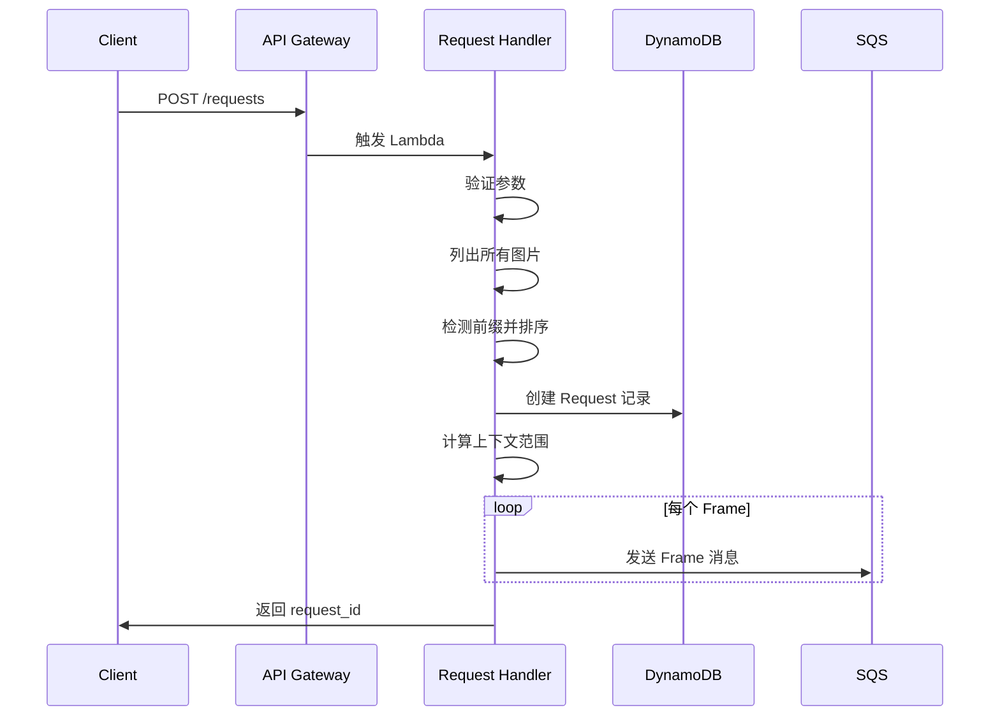
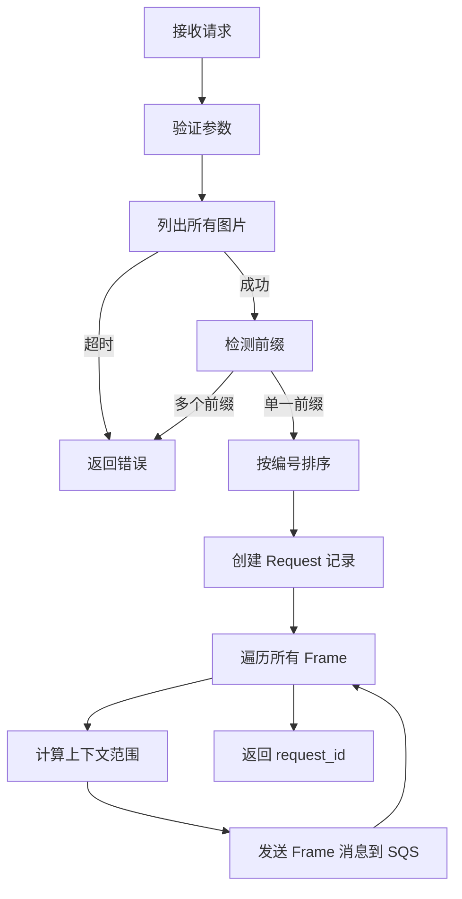
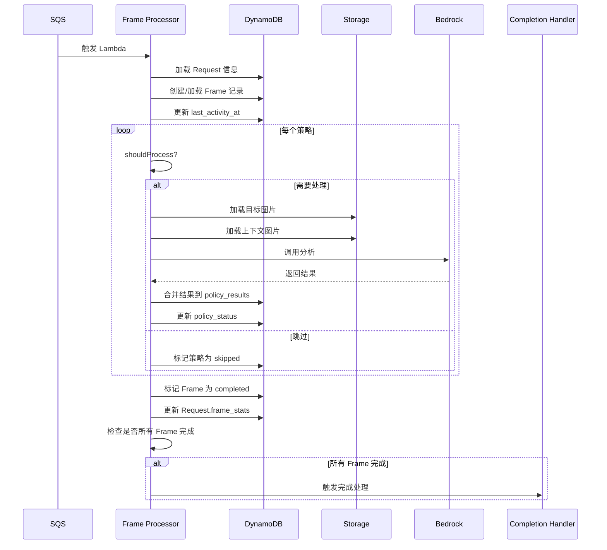
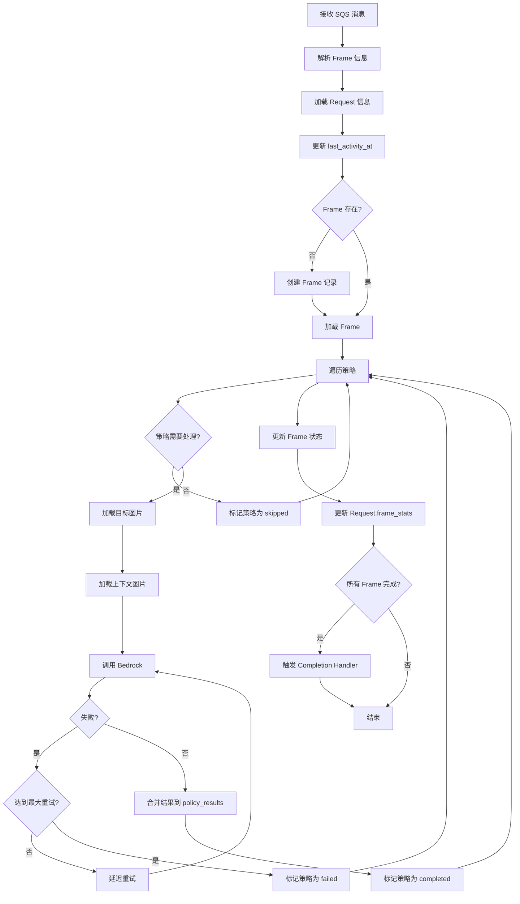
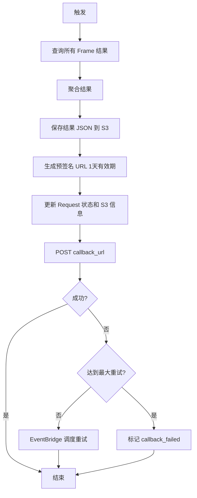
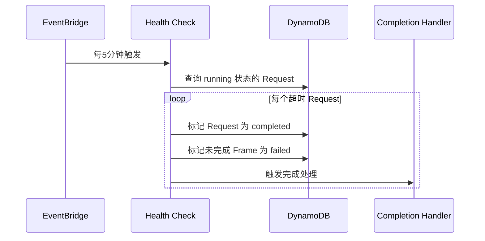
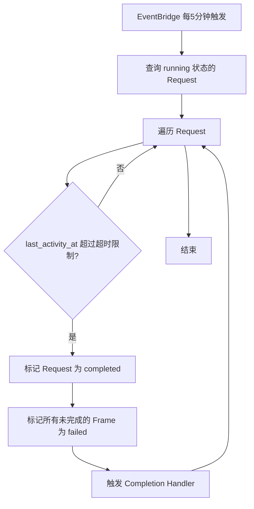

# 处理流程文档

## 处理流程

### 时序图：提交请求

### Request Handler 流程

**关键点：**
- 不创建 Frame 记录，由 Frame Processor 按需创建
- 每个 Frame 一条 SQS 消息
- SQS 消息包含：`{request_id, frame_index, target_frame_url, before_frame_urls, after_frame_urls}`
- before_frame_urls 和 after_frame_urls 最多各包含 CONTEXT_MAX_FRAMES 个 URL

### 时序图：处理单个 Frame

### Frame Processor 流程

**关键点：**
- 每个 Lambda 实例处理一个 Frame
- 策略顺序执行（循环），不是并行
- 单个 Lambda 实例同时只调用 Bedrock 一次
- 按需创建 Frame 记录，避免初始化时大量写入
- 处理前检查 Frame.status，跳过已完成的帧（支持重试）
- 每次处理更新 Request.last_activity_at
- **图片加载**：Frame Processor 使用 HTTP GET 下载图片到内存，然后将 bytes 数据传给策略
- 上下文加载：根据 SQS 消息中的 before_frame_urls 和 after_frame_urls 下载上下文帧
- 结果合并：将策略的 key-value 结果合并到 Frame.policy_results 中
- 如果策略的 shouldProcess 返回 false，跳过该帧并标记为 skipped（对该策略）
- 完成检测：查询 Request.frame_stats，如果 completed + failed == total_frames 则触发 Completion Handler
- 使用乐观锁（version）更新 Request.frame_stats，防止并发冲突

### Completion Handler 流程

**关键点：**
- 从 DynamoDB 查询所有 Frame 记录（按 request_id）
- 聚合结果：按策略和帧索引组织
- 保存到 S3：`results/{request_id}/result.json`
- 生成预签名 URL（1天有效期）
- 回调数据包含：S3 bucket、key、预签名 URL、过期时间
- 建议用户使用 bucket 和 key 直接访问（长期有效）

### 时序图：Health Check

### Health Check 流程

**关键点：**
- 防止请求永久卡住
- 超时限制：REQUEST_TIMEOUT（默认 2 小时）
- 超时后强制标记为完成，允许部分帧失败
- 未完成的 Frame 标记为 failed，但保留已有的部分结果（如果某些策略已完成）
- 触发 Completion Handler 生成结果并回调
- 结果中包含失败的帧信息
